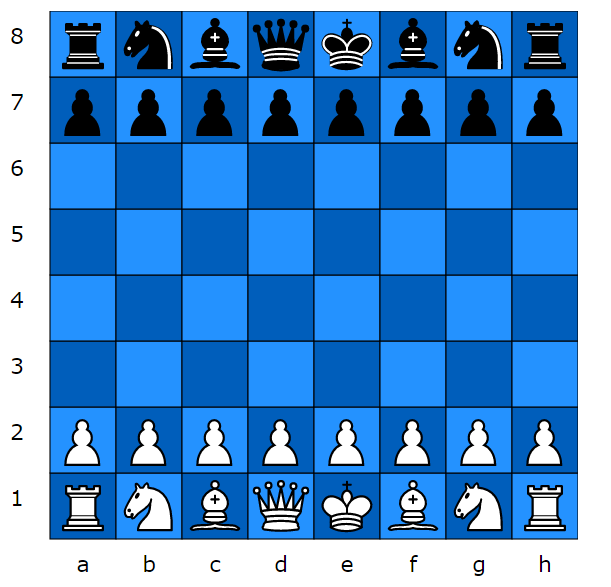

# react-chessdiagram
Chess Diagram React Component

LIVE DEMO: [http://chessdiagram.juddn.com](http://chessdiagram.juddn.com)

NPM: [https://www.npmjs.com/package/react-chessdiagram](https://www.npmjs.com/package/react-chessdiagram)

A react component that can display chess positions from FEN strings or a form of algebraic notation (P@a5 R@h8 etc)

It is almost entirely stateless. (some state is maintained to keep track of mouse / touch events.)

A callback facility is provided to report dragged pieces back to the host application.

API documentation: [./api.md](./api.md)

### sample usage

	import React, { Component } from 'react';
	import ReactDOM from 'react-dom';	
    import Chessdiagram from 'react-chessdiagram';
	
	const lightSquareColor = "#2492FF"; // light blue
	const darkSquareColor = "#005EBB"; // dark blue
	const currentPosition =  "rnbqkbnr/pppppppp/8/8/8/8/PPPPPPPP/RNBQKBNR w KQkq - 0 1"; // starting position
	const flip = false;
	const squareSize = 30;

	ReactDOM.render(
		<Chessdiagram flip={flip} fen={currentPosition} squareSize={squareSize} 
        	lightSquareColor={lightSquareColor} darkSquareColor={darkSquareColor} onMovePiece={onMovePiece}/>,
  		document.getElementById('root')
	);

	function onMovePiece(piece, fromSquare, toSquare) {
		let message = 'You moved ' + piece + fromSquare + " to " + toSquare + ' !';
		console.log(message);
	}

### build commands:

dev: **npm run dev** - (output to ./build/dev.chessdiagram.js and served on http://localhost:8080 by dev server)

dist: **npm run build** - (output to ./build/dist.chessdiagram.js)

lint: **npm run lint** - runs ESLint

generate API documentation: **npm run generate-docs**

testing: **npm test**

### to-do: 

- add a prop for optionally hiding labels etc.
- show side to move, castling rights and other info
- show arrows etc
- handle remaining 5 FEN fields etc
- more piece types

### recently completed:
- Test suite
- deal with Scrolling properly !
- publish to npm (Yippee - it's up there !!)
- auto API-doc (api.md)
- webpack setup for distributing as component with demo.

